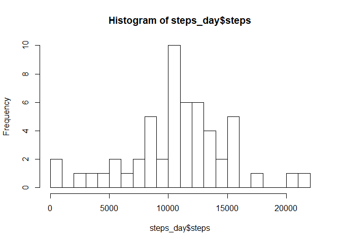
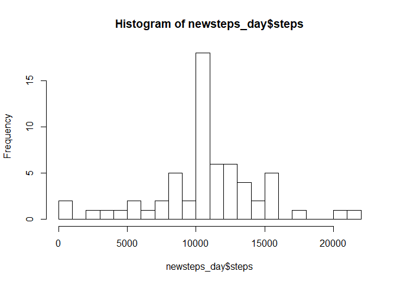
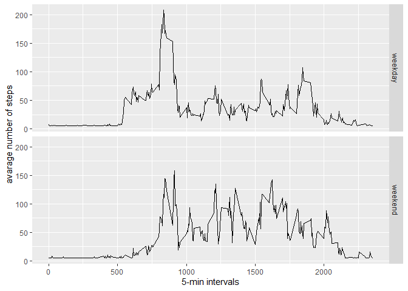

Reproducible reserch
--------------------

    library(ggplot2)
    data <- read.csv("activity.csv", header = TRUE, sep = ",", na.strings = "NA")
    #data$date <- as.POSIXct(data$date)
    head(data)

    ##   steps       date interval
    ## 1    NA 2012-10-01        0
    ## 2    NA 2012-10-01        5
    ## 3    NA 2012-10-01       10
    ## 4    NA 2012-10-01       15
    ## 5    NA 2012-10-01       20
    ## 6    NA 2012-10-01       25

### Suumary data

    summary(data)

    ##      steps                date          interval     
    ##  Min.   :  0.00   2012-10-01:  288   Min.   :   0.0  
    ##  1st Qu.:  0.00   2012-10-02:  288   1st Qu.: 588.8  
    ##  Median :  0.00   2012-10-03:  288   Median :1177.5  
    ##  Mean   : 37.38   2012-10-04:  288   Mean   :1177.5  
    ##  3rd Qu.: 12.00   2012-10-05:  288   3rd Qu.:1766.2  
    ##  Max.   :806.00   2012-10-06:  288   Max.   :2355.0  
    ##  NA's   :2304     (Other)   :15840

### Structure

    str(data)

    ## 'data.frame':    17568 obs. of  3 variables:
    ##  $ steps   : int  NA NA NA NA NA NA NA NA NA NA ...
    ##  $ date    : Factor w/ 61 levels "2012-10-01","2012-10-02",..: 1 1 1 1 1 1 1 1 1 1 ...
    ##  $ interval: int  0 5 10 15 20 25 30 35 40 45 ...

What is mean total number of steps taken per day? For this part of the
assignment, we can ignore the missing values in the dataset.

    cleardata <- data[!is.na(as.character(data$steps)),]

1.  Calculate the total number of steps taken per day

<!-- -->

    steps_day <- aggregate(steps ~ date, data = cleardata, sum)
    head(steps_day)

    ##         date steps
    ## 1 2012-10-02   126
    ## 2 2012-10-03 11352
    ## 3 2012-10-04 12116
    ## 4 2012-10-05 13294
    ## 5 2012-10-06 15420
    ## 6 2012-10-07 11015

1.  Make a histogram of the total number of steps taken each day

<!-- -->

    hist(steps_day$steps, breaks = 25)

1.  Calculate and report the mean and median of the total number of
    steps taken per day

<!-- -->

    mean(steps_day$steps)

    ## [1] 10766.19

    median(steps_day$steps)

    ## [1] 10765

What is the average daily activity pattern? Make a time series plot
(i.e. type=“l”) of the 5-minute interval (x-axis) and the average number
of steps taken, averaged across all days (y-axis) Which 5-minute
interval, on average across all the days in the dataset, contains the
maximum number of steps?

    steps_interval <- aggregate(cleardata$steps, by=list(interval=cleardata$interval), FUN=mean)
    ggplot(steps_interval, aes(x = interval, y = x)) + geom_line(color="blue", size=1) + labs(title = "Avg. Daily Steps", x = "Interval", y = "Avg. Steps per day")

Which 5-minute interval, on average across all the days in the dataset,
contains the maximum number of steps?

    max(steps_interval$x)

    ## [1] 206.1698

Imputing missing values
-----------------------

1.  Missing value

<!-- -->

    sum(is.na(as.character(data$steps)))

    ## [1] 2304

Imputing missing values
-----------------------

1.  Missing value

<!-- -->

    newdata <- data
    newdata$steps[is.na(data$steps)] <- mean(data$steps, na.rm = T)
    colSums(is.na(newdata))

    ##    steps     date interval 
    ##        0        0        0

    newsteps_day <- aggregate(steps ~ date, data = newdata, sum)
    hist(newsteps_day$steps, breaks = 25)

    #head(newdata)

\#Panel plot comparing the average number of steps taken per 5-minute
interval across weekdays and weekends

    newdata$DayType <-  ifelse(as.POSIXlt(newdata$date)$wday %in% c(0,6), 'weekend', 'weekday')
    head(newdata)

    ##     steps       date interval DayType
    ## 1 37.3826 2012-10-01        0 weekday
    ## 2 37.3826 2012-10-01        5 weekday
    ## 3 37.3826 2012-10-01       10 weekday
    ## 4 37.3826 2012-10-01       15 weekday
    ## 5 37.3826 2012-10-01       20 weekday
    ## 6 37.3826 2012-10-01       25 weekday

    newdata_mean <- aggregate(steps ~ interval + DayType, data=newdata, mean)
    ggplot(newdata_mean, aes(interval, steps)) + 
        geom_line() + 
        facet_grid(DayType ~ .) +
        xlab("5-min intervals") + 
        ylab("avarage number of steps")

